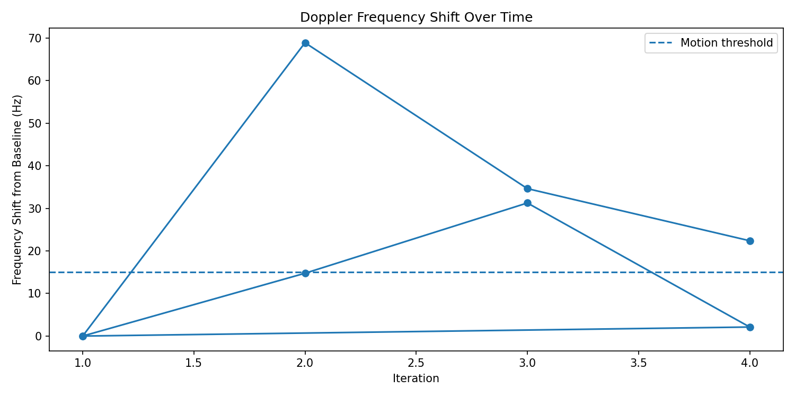
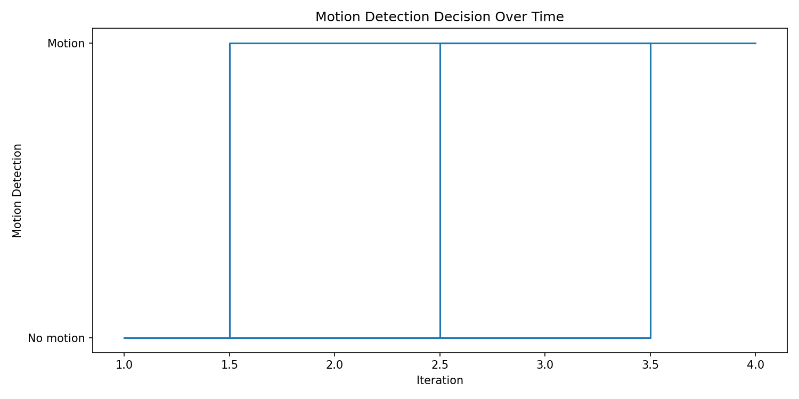
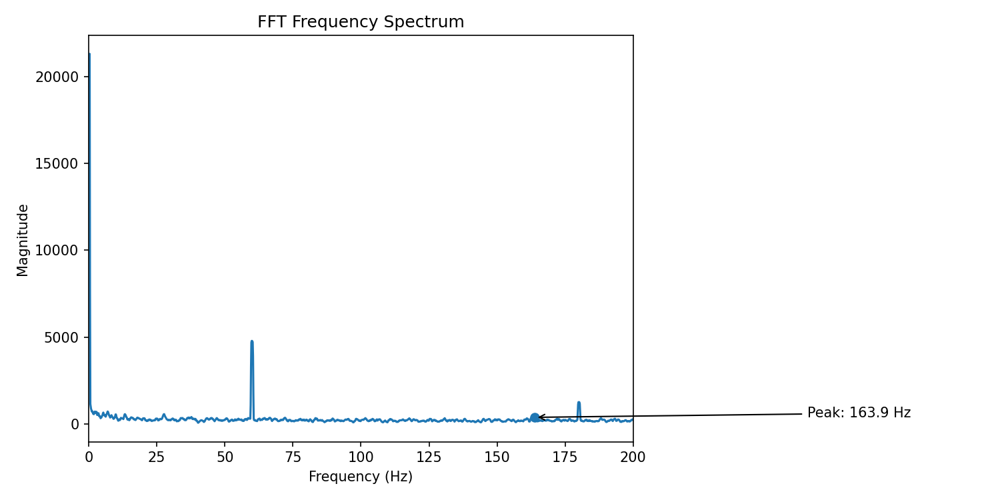

# Raspberry Pi Doppler Radar Signal Processing System

## Overview

This project implements a real-time Doppler radar signal processing system on a Raspberry Pi using an HB100 microwave radar module, analog signal conditioning, and FFT-based spectral analysis.

The system captures the radar module’s intermediate-frequency output, digitizes the signal, extracts Doppler frequency components via FFT, estimates target velocity, and detects motion using baseline frequency shift analysis.

---

## Hardware

- HB100 Doppler radar module  
- LM358 analog amplifier  
- HiFiBerry DAC+ ADC Pro  
- Raspberry Pi 4  
- RCA audio input connection  

---
## Signal Chain

```
HB100 Radar Module
        ↓ IF signal
LM358 Analog Amplifier
        ↓ amplified analog signal
HiFiBerry ADC
        ↓ digitized audio
Raspberry Pi
        ↓
Python FFT Pipeline
        ↓
Frequency Shift + Motion Detection
```

---

## Processing Pipeline

1. Record radar IF signal as WAV audio  
2. Compute FFT spectrum from captured samples  
3. Apply smoothing and ignore known interference bands  
4. Detect dominant frequency peak in the Doppler search range  
5. Estimate velocity from Doppler frequency  
6. Establish a baseline frequency from the no-motion case  
7. Classify motion when frequency shift exceeds a threshold  
8. Save outputs to JSON, CSV, and generated plots  

---

## Motion Detection Logic

The first capture is treated as the baseline. Later captures are compared against that baseline frequency.

```
frequency_shift = abs(current_peak_frequency - baseline_frequency)

motion_detected = frequency_shift > 15 Hz
```

This approach was used because the analog front end produced a noisy spectrum where traditional peak-ratio confidence alone was not reliable.

---

## Example Results

In one demo run:

| Iteration | Peak Frequency (Hz) | Frequency Shift (Hz) | Motion Detected |
|----------|--------------------|----------------------|----------------|
| 1        | 96.50              | 0.00                 | False          |
| 2        | 81.75              | 14.75                | False          |
| 3        | 127.75             | 31.25                | True           |
| 4        | 94.38              | 2.12                 | False          |

These results demonstrate that motion events produce measurable frequency shifts (~25–70 Hz), while stationary or low-motion cases remain near baseline, enabling reliable classification despite low signal confidence.

---

## Visual Outputs

### Frequency Shift Tracking


### Motion Detection Tracking


### FFT Spectrum Example


---

## Output Files

- JSON files containing structured signal analysis results  
- CSV tracking logs for time-series analysis  
- FFT spectrum plots  
- Frequency shift and motion detection plots  

---

## Technologies Used

- Python  
- NumPy  
- Matplotlib  
- Raspberry Pi OS (Linux)  
- ALSA audio capture  
- FFT-based signal processing  
- Analog signal conditioning  

---

## Current Limitations

- 60 Hz mains interference and harmonics  
- LM358 amplifier noise  
- Prototype wiring and environmental noise  
- No dedicated analog band-pass filtering  

Despite these limitations, the system demonstrates a complete radar signal processing pipeline.
Software-side filtering and baseline comparison were introduced to compensate for hardware noise and achieve usable motion detection without additional analog filtering hardware.

---

## Future Improvements

- Add analog band-pass filtering  
- Use lower-noise amplifier  
- Improve ADC resolution  
- Add real-time visualization  
- Improve velocity calibration  
- Automate baseline detection  
